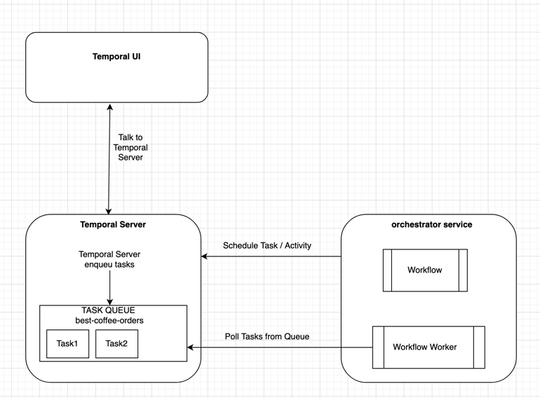

# best-coffe-shop
Temporal.io tutorial in python

We added orchestrator-service with workflow `CoffeeOrderWorkflow` .  Check related blog posts for more information.

#### Tech Stack :
    docker, 
    docker-compose, 
    python, 
    temporal, 
    SvelteJS - Web UI

#### 📖 Related Blog Posts
- [Brewing Backend Workflows: Setting Up Temporal for Best-Coffee-Shop](https://anieruddha.hashnode.dev/brewing-backend-workflows-setting-up-temporal-for-best-coffee-shop)

- [Brewing Backend Workflows: Your First Temporal Workflow, One Cup at a Time](https://anieruddha.hashnode.dev/temporal-workflow)

#### Setup
Run `docker-compose up` to create temporal container

#### Diagram

